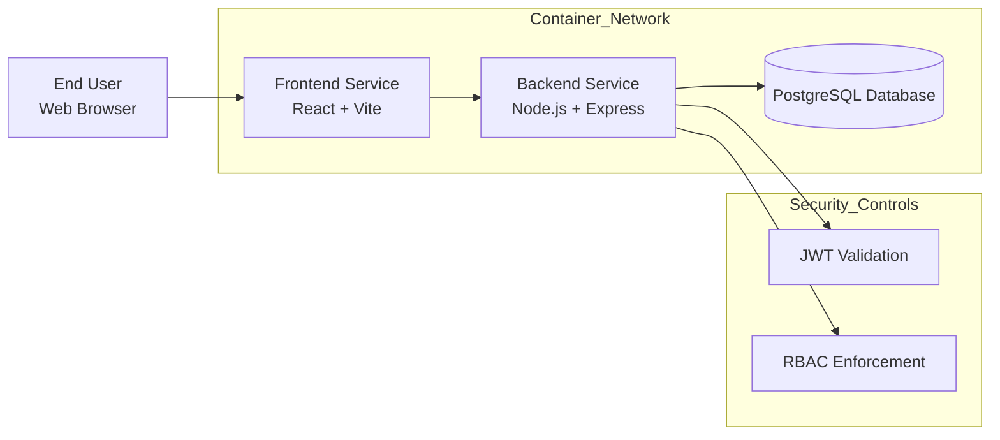
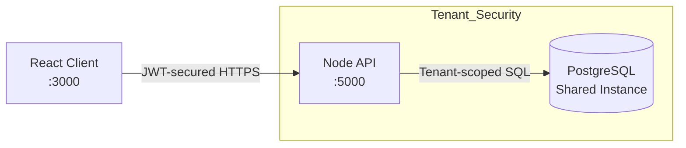
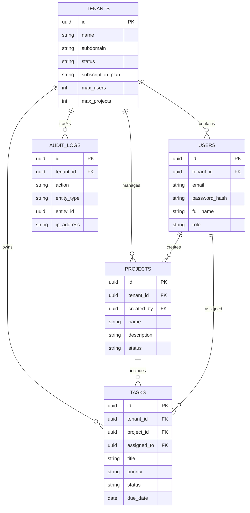

# System Architecture Specification

**Application Name:** Multi-Tenant SaaS Project & Task Management Platform
**Document Version:** 1.0
**Prepared On:** October 26, 2025
**Prepared By:** Student Cloud Engineer / Primary Developer

---

## 1. Architectural Overview

The platform is implemented using a **container-based three-layer architecture**, optimized for scalability, maintainability, and strict tenant isolation.
All services are packaged and orchestrated through **Docker Compose**, ensuring uniform behavior across development, testing, and deployment environments.

The architecture cleanly separates:

* Presentation logic
* Application logic
* Persistent storage

---

## 2. Logical Architecture Diagram



---

## 3. Architectural Style

The system follows a **multi-tenant, service-oriented architecture** with a strong boundary between layers:

* **Frontend** handles UI and user experience
* **Backend** enforces business rules, security, and tenant boundaries
* **Database** persists all tenant-scoped data

Each tenant shares the same infrastructure while remaining logically isolated.

---

## 4. Component Breakdown

### 4.1 Presentation Tier (Frontend)

* **Framework:** React.js
* **Build Tool:** Vite
* **Container Mapping:** `3000 → 3000`
* **Primary Functions:**

  * Render dashboards and forms
  * Capture user interactions
  * Store and transmit JWT tokens
  * Communicate with backend APIs
* **Tenant Identification:**

  * Derived from subdomain (e.g., `org1.app.com`)
  * Or explicitly provided during authentication

---

### 4.2 Application Tier (Backend API)

* **Runtime:** Node.js
* **Framework:** Express.js
* **Container Mapping:** `5000 → 5000`
* **Core Responsibilities:**

  * Request processing and business logic
  * Token-based authentication
  * Role-based authorization
  * Tenant boundary enforcement
* **Tenant Isolation Flow:**

  * JWT contains tenant metadata
  * Middleware extracts `tenant_id`
  * Database queries are automatically scoped
  * Cross-tenant access is blocked at middleware level

---

### 4.3 Persistence Tier (Database)

* **Database Engine:** PostgreSQL v15
* **Container Mapping:** `5432 → 5432`
* **Data Strategy:**

  * Centralized database
  * Shared schema
  * Logical isolation via `tenant_id`
* **Isolation Guarantee:**

  * Every tenant-owned record includes `tenant_id`
  * No query executes without tenant filtering

---

## 5. Simplified System Flow



---

## 6. Database Design (Entity Relationship Model)

The database is structured following **Third Normal Form (3NF)** principles to minimize redundancy and ensure consistency.

A dedicated `tenant_id` field acts as the **logical partition key**, enabling multi-tenancy within a shared schema.



---

## 7. Table Specifications

### 7.1 Tenants (Master Table)

* **Primary Key:** UUID
* **Attributes:**

  * Organization name
  * Unique subdomain
  * Subscription status and limits
* **Notes:**

  * Parent entity for all tenant-related data

---

### 7.2 Users

* **Primary Key:** UUID
* **Foreign Key:** `tenant_id`
* **Key Constraints:**

  * `(tenant_id, email)` must be unique
* **Purpose:**

  * Store authentication and authorization data

---

### 7.3 Projects

* **Primary Key:** UUID
* **Foreign Keys:**

  * `tenant_id`
  * `created_by`
* **Indexing Strategy:**

```sql
CREATE INDEX idx_projects_tenant ON projects(tenant_id);
```

---

### 7.4 Tasks

* **Primary Key:** UUID
* **Foreign Keys:**

  * `tenant_id`
  * `project_id`
  * `assigned_to`
* **Indexing Strategy:**

```sql
CREATE INDEX idx_tasks_tenant ON tasks(tenant_id);
```

---

### 7.5 Audit Logs

* **Purpose:** Track critical system actions
* **Stored Data:**

  * Action type
  * Entity reference
  * IP address
* **Security Benefit:**

  * Enables compliance and traceability

---

## 8. API Design Principles

The backend exposes **19 REST-compliant endpoints** following consistent naming and response patterns.

### Standard API Response Model

```json
{
  "success": true,
  "message": "Request processed successfully",
  "data": {}
}
```

---

## 9. API Modules

### Authentication Services

| Method | Endpoint                    | Description             | Auth | Role   |
| -----: | --------------------------- | ----------------------- | ---- | ------ |
|   POST | `/api/auth/register-tenant` | Create tenant and admin | No   | Public |
|   POST | `/api/auth/login`           | Authenticate user       | No   | Public |
|    GET | `/api/auth/me`              | Fetch active user       | Yes  | All    |
|   POST | `/api/auth/logout`          | End user session        | Yes  | All    |

---

### Tenant Administration

| Method | Endpoint                 | Description                 | Auth | Role               |
| -----: | ------------------------ | --------------------------- | ---- | ------------------ |
|    GET | `/api/tenants`           | Retrieve all tenants        | Yes  | Super Admin        |
|    GET | `/api/tenants/:tenantId` | Tenant details              | Yes  | Super/Tenant Admin |
|    PUT | `/api/tenants/:tenantId` | Update tenant configuration | Yes  | Authorized Admin   |

---

### User Management

| Method | Endpoint                       | Description | Auth | Role          |
| -----: | ------------------------------ | ----------- | ---- | ------------- |
|   POST | `/api/tenants/:tenantId/users` | Add user    | Yes  | Tenant Admin  |
|    GET | `/api/tenants/:tenantId/users` | List users  | Yes  | Tenant Member |
|    PUT | `/api/users/:userId`           | Modify user | Yes  | Admin or Self |
| DELETE | `/api/users/:userId`           | Remove user | Yes  | Tenant Admin  |

---

### Project Services

| Method | Endpoint                   | Description    | Auth | Role          |
| -----: | -------------------------- | -------------- | ---- | ------------- |
|   POST | `/api/projects`            | Create project | Yes  | Tenant Member |
|    GET | `/api/projects`            | List projects  | Yes  | Tenant Member |
|    PUT | `/api/projects/:projectId` | Update project | Yes  | Owner/Admin   |
| DELETE | `/api/projects/:projectId` | Delete project | Yes  | Owner/Admin   |

---

### Task Services

| Method | Endpoint                         | Description        | Auth | Role          |
| -----: | -------------------------------- | ------------------ | ---- | ------------- |
|   POST | `/api/projects/:projectId/tasks` | Create task        | Yes  | Tenant Member |
|    GET | `/api/projects/:projectId/tasks` | List tasks         | Yes  | Tenant Member |
|  PATCH | `/api/tasks/:taskId/status`      | Update task status | Yes  | Tenant Member |
|    PUT | `/api/tasks/:taskId`             | Update task fully  | Yes  | Tenant Member |

---

## 10. Architectural Strengths

✔ True multi-tenant isolation
✔ Secure JWT-based authentication
✔ Role-aware access control
✔ Scalable containerized deployment
✔ Industry-grade SaaS design principles

---
