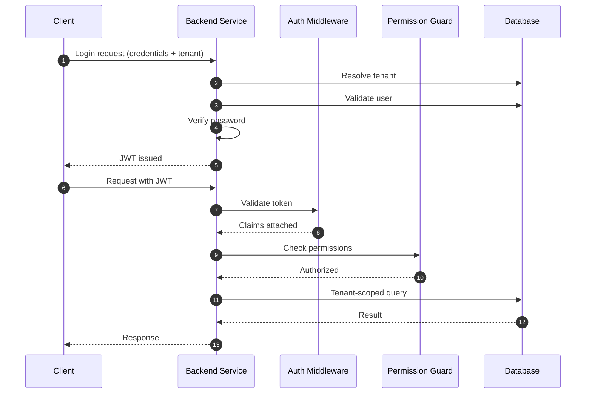

# Research Study: Architecture of a Multi-Tenant SaaS Platform

**System Name:** Multi-Tenant SaaS Project & Task Management Solution
**Prepared On:** October 26, 2025
**Prepared By:** Cloud Computing Student / Primary Engineer
**Document State:** Approved for Build Phase

---

## 1. Study of Multi-Tenancy Models

Multi-tenancy refers to the capability of a single software system to serve multiple independent customer organizations, referred to as **tenants**, while maintaining logical separation of their data and operations.

In SaaS systems, the **data isolation strategy** is the most impactful architectural choice, as it influences:

* Security guarantees
* Scalability potential
* Operational complexity
* Infrastructure cost

This section evaluates the three most commonly used multi-tenancy data models.

---

## A. Shared Database with Shared Schema (Discriminator Strategy)

Often called the **pooled tenancy model**, this approach stores all tenant data in a single database and schema, distinguishing records using a tenant identifier.

### How It Works

* Every tenant-owned table includes a `tenant_id` column
* All queries are filtered using `tenant_id`
* Isolation is enforced at the application and middleware layers

### Advantages

* Lowest operational cost
* Extremely fast tenant provisioning
* Minimal database management overhead
* Enables global analytics across tenants

### Limitations

* High dependency on correct query filtering
* Tenant-specific backups are complex
* Risk of performance interference between tenants

---

## B. Shared Database with Isolated Schemas

Commonly known as the **schema-per-tenant model**, this approach assigns each tenant a dedicated schema within the same database.

### How It Works

* Each tenant has its own schema namespace
* Database search paths are adjusted dynamically
* Tables are physically separated by schema

### Advantages

* Improved isolation compared to shared schema
* Easier tenant-level backup and restore
* Supports limited schema customization

### Limitations

* Database migrations become costly as tenants grow
* Schema management overhead increases significantly
* Deployment speed degrades at scale

---

## C. Dedicated Database per Tenant

Also referred to as the **silo model**, this strategy provisions a separate database instance for each tenant.

### How It Works

* A routing layer maps tenant identifiers to database connections
* Each tenant has full data isolation

### Advantages

* Strongest isolation and security
* No cross-tenant performance interference
* Suitable for compliance-heavy industries

### Limitations

* Very high infrastructure and maintenance cost
* Complex connection management
* Not practical for freemium or startup SaaS models

---

## Comparative Evaluation

| Criteria              | Shared Schema | Separate Schema | Separate Database |
| --------------------- | ------------- | --------------- | ----------------- |
| Data Isolation        | Low           | Moderate        | Very High         |
| Operational Cost      | Low           | Medium          | High              |
| Tenant Onboarding     | Instant       | Fast            | Slow              |
| Maintenance Effort    | Low           | High            | Very High         |
| Risk of Data Exposure | Higher        | Medium          | Minimal           |
| Scalability Style     | Vertical      | Vertical        | Horizontal        |

---

## Selected Model: Shared Database with Shared Schema

### Rationale for Selection

1. **MVP-Focused Development**
   Prioritizes feature delivery over infrastructure complexity.

2. **ORM Alignment**
   The selected ORM (Prisma) integrates cleanly with discriminator-based tenancy.

3. **Containerized Deployment**
   Simplifies deployment using Docker Compose with a single database service.

4. **Controlled Risk Mitigation**
   Tenant isolation is enforced centrally via middleware, reducing developer error.

---

## 2. Technology Selection Rationale

### Backend Platform: Node.js with Express

**Reasons for Selection**

* Event-driven, non-blocking I/O for concurrent users
* Middleware architecture fits tenant isolation logic
* Unified language across frontend and backend

**Alternatives Considered**

* Django (less flexible for middleware-heavy designs)
* Spring Boot (higher memory and setup overhead)

---

### Frontend Framework: React with Vite

**Reasons for Selection**

* Component-based UI architecture
* High rendering efficiency via Virtual DOM
* Fast development builds using Vite

**Alternatives Considered**

* Angular (higher complexity and learning curve)

---

### Data Store: PostgreSQL

**Reasons for Selection**

* Strong relational consistency
* Native support for cascading operations
* JSONB support for flexible fields
* Future compatibility with row-level security

**Alternatives Considered**

* MongoDB (weaker relational guarantees)

---

### Authentication Strategy: JSON Web Tokens (JWT)

**Reasons for Selection**

* Stateless authentication
* Scales well across containers
* Works across subdomains

**Alternatives Considered**

* Server-side sessions (requires Redis or shared store)

---

### Deployment Tooling: Docker & Docker Compose

**Reasons for Selection**

* Identical environments across systems
* Simplified onboarding for evaluators
* Lightweight service orchestration

---

## 3. Security Architecture

### Isolation Enforcement via Middleware

* JWT is validated on every protected request
* `tenant_id` is extracted from the token
* Client-supplied tenant identifiers are never trusted

---

### Password Protection

* All passwords are hashed using **Bcrypt**
* Minimum salt rounds: 10
* Protects against brute-force and rainbow-table attacks

---

### Role-Based Authorization (RBAC)

| Role          | Permission Scope               |
| ------------- | ------------------------------ |
| System Admin  | Global platform access         |
| Tenant Admin  | Full organization control      |
| Standard User | Restricted project/task access |

Authorization checks are executed **before database interaction**.

---

### API Protection Measures

* Strict CORS configuration
* Rate limiting on authentication endpoints
* Security headers via HTTP hardening middleware

---

### ORM & Input Safety

* All inputs validated before processing
* Parameterized queries via ORM
* Eliminates SQL injection vectors

---

## Tenant-Scoped Data Access Pattern

All tenant-owned records include a `tenant_id`.
Every query is explicitly scoped using this identifier:

```sql
SELECT *
FROM tasks
WHERE id = :taskId
AND tenant_id = :authenticatedTenantId;
```

If the tenant does not match, the system responds with **404 Not Found**, preventing inference of foreign tenant data.

---

## Authentication and Authorization Lifecycle

### Step 1: User Sign-In

The user submits credentials along with their organization identifier.

### Step 2: Tenant Resolution

The backend resolves the tenant and validates user credentials within that tenant context.

### Step 3: Token Generation

A signed JWT is issued containing:

```json
{
  "userId": "<uuid>",
  "tenantId": "<uuid>",
  "role": "<role>"
}
```

---

### Step 4: Authenticated Requests

All protected API calls include the token:

```http
Authorization: Bearer <JWT>
```

---

### Step 5: Token Verification

The backend validates the signature and extracts claims into the request context.

---

### Step 6: Authorization Enforcement

RBAC guards verify whether the role permits access to the requested resource.

* Authorization occurs before business logic
* Unauthorized access is blocked early
* Least-privilege principle is enforced

---

## Authentication & Authorization Flow Diagram



---

## Research Conclusion

✔ Selected architecture balances cost, scalability, and security
✔ Tenant isolation enforced consistently across layers
✔ Technology stack aligns with modern SaaS best practices
✔ Suitable for academic, startup, and cloud evaluation contexts

---
